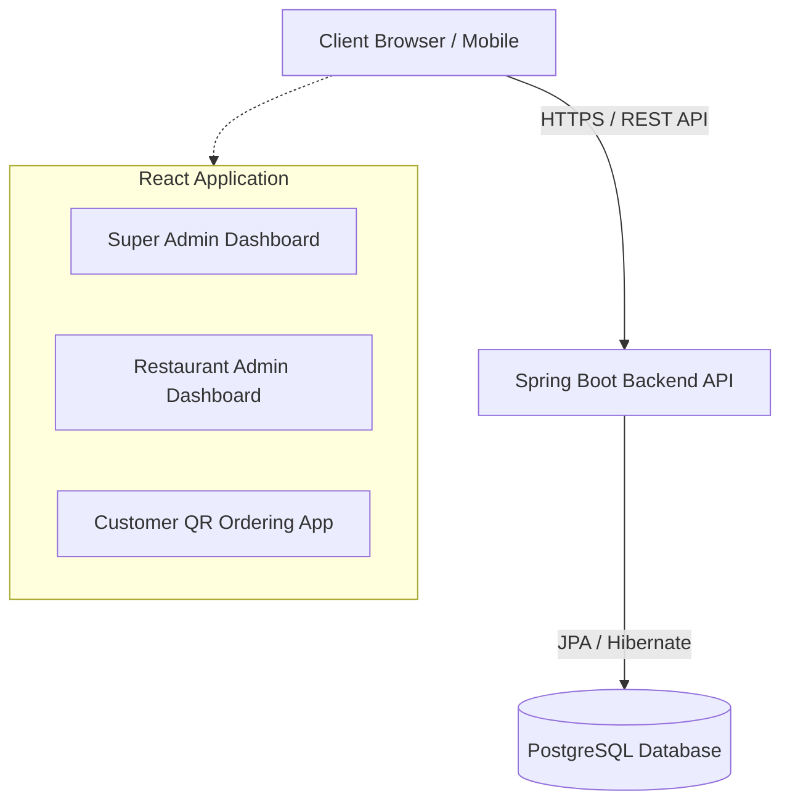
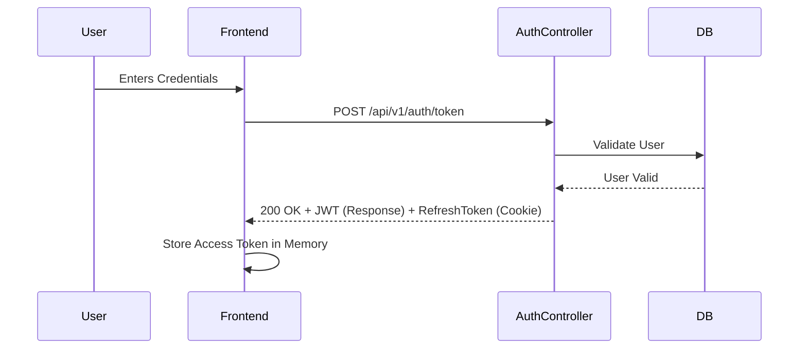
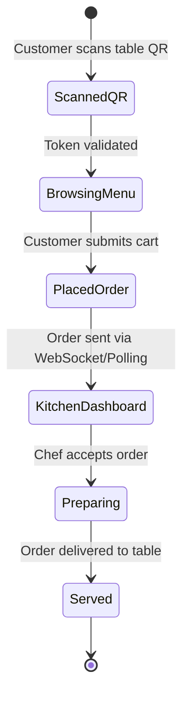

# System Architecture

ScanNServe is a multi-tenant SaaS application that allows restaurants to manage their menus, tables, and incoming orders via QR code scanning. 

## 1. High Level Architecture

The application is built using a modern decoupled architecture:
- **Frontend**: React (Vite) Single Page Application (SPA).
- **Backend**: Java Spring Boot providing a RESTful API.
- **Database**: PostgreSQL for relational data storage.

---

## 2. Authentication Flow

Authentication is managed using JSON Web Tokens (JWT) and HTTP-only cookies to ensure security against XSS.

---

## 3. Multi-Tenancy Design

The system implements logical multi-tenancy. A single instance of the backend and database serves multiple restaurants.
- **SuperAdmin**: Global access. Can register new `RestaurantEntity`.
- **RestaurantAdmin**: Bound to a specific `restaurant_id`. They can only manage data that has a matching `restaurant_id`.
- **Customers (QR)**: The QR code contains a `tableToken` which intrinsically links the customer session to a specific table and restaurant.

---

## 4. Kitchen & Order Workflow (Conceptual)

While the full order socket flow is handled internally, the conceptual workflow is as follows:

## 5. Folder Structure

### Backend (`src/main/java/com/app/ScanNServe`)
- `controller/`: REST API endpoints and interface definitions.
- `service/`: Business logic layer.
- `domain/entity/`: JPA entities representing database tables.
- `domain/repository/`: Spring Data JPA repository interfaces.
- `dto/`: Data Transfer Objects for API requests and responses.
- `config/`: Spring Security and Bean configurations.
- `exception/`: Global exception handlers.

### Frontend (`client/fe-serve`)
- `src/components/`: Reusable UI elements (Buttons, Inputs).
- `src/pages/`: Main route views (Dashboards, Login).
- `src/context/` or `src/store/`: State management.
- `src/utils/`: Axios interceptors, formatting helpers.
