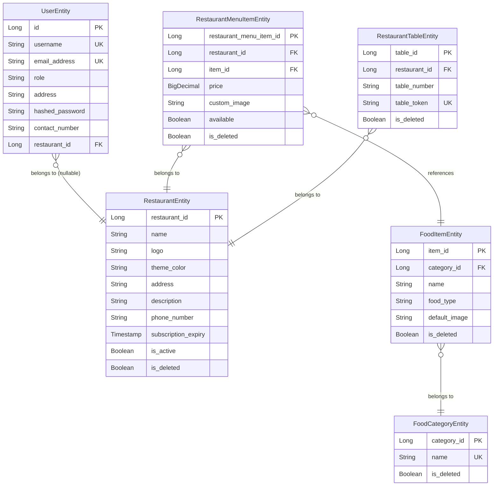

# Database Documentation

This document explains the database schema, entity relationships, and core tables used in ScanNServe. The system utilizes PostgreSQL and is managed via Spring Data JPA.

## Entity Relationship Diagram (ERD)

## Core Entities

### 1. `RestaurantEntity`
Represents a registered restaurant in the platform. 
- **Primary Key**: `restaurant_id`
- **Fields**: `name`, `logo`, `theme_color`, `address`, `description`, `phone_number`, `subscription_expiry`, `is_active`.
- **Purpose**: The central entity for multi-tenancy. Most other entities link back to a specific restaurant.

### 2. `UserEntity`
Represents the users of the system (SuperAdmin, RestaurantAdmin, KitchenStaff, etc.).
- **Primary Key**: `id`
- **Fields**: `username`, `email_address`, `role`, `hashed_password`, `contact_number`, `restaurant_id`.
- **Constraints**: `username` and `email_address` are unique.
- **Relationships**: A user can optionally belong to a `RestaurantEntity` (if they are restaurant staff). A SuperAdmin does not belong to a specific restaurant.

### 3. `FoodCategoryEntity`
Defines global or common categories for food (e.g., Starters, Main Course, Beverages).
- **Primary Key**: `category_id`
- **Constraints**: `name` is unique.

### 4. `FoodItemEntity`
A master catalog of food items available to be added to restaurant menus.
- **Primary Key**: `item_id`
- **Relationships**: Belongs to a `FoodCategoryEntity`.

### 5. `RestaurantMenuItemEntity`
The intersection between a restaurant and the master food items. It represents the actual menu of a restaurant.
- **Primary Key**: `restaurant_menu_item_id`
- **Fields**: `price`, `custom_image`, `available`.
- **Relationships**: Belongs to `RestaurantEntity` and references a `FoodItemEntity`.
- **Constraints**: Unique constraint on `[restaurant_id, item_id]` to prevent duplicate items in a menu.

### 6. `RestaurantTableEntity`
Represents the physical tables in a restaurant used for QR ordering.
- **Primary Key**: `table_id`
- **Fields**: `table_number`, `table_token`.
- **Constraints**: Unique constraint on `[restaurant_id, table_number]`. `table_token` is globally unique.
